# Run Airflow via Docker on local machine

This project shows how to run Airflow using LocalExecutor to download data from a website and upload it to a postgres database running in a Docker container. The tools/components used include:

1. A python script to download .csv file from a website and upload it to a postgres db
2. The postgres db is made accessible via pgadmin
3. Steps 1 & 2 are containerized using Docker-compose and the entire workflow is orchestrated using Airflow

Below are the steps to set up and run the entire workflow. Detailed explanations of the dockerfile, docker-compose, dags and scripts are included.


## Steps to run Airflow locally via Docker

### Set up the directories and scripts:

Clone this repo. Alternatively:
1. start a new project folder (let's call it “airflow”), make empty folders ./dags, ./logs and ./plugins inside the airflow directory - these folders are required by airflow. 
2. Save the python scripts and the dag in the ./dags folder.
3. Save the dockerfile and docker-compose file in the airflow folder.
4. Save the .env and requirements.txt file in the airflow folder.
5. Make a new empty folder called scripts and save the entrypoint.sh file in it


```bash
mkdir -p ./dags ./logs ./plugins
mkdir ./scripts
```

### Run docker-compose:
1. Make sure your docker desktop is running. From inside the airflow directory, build the docker-compose image:

```bash
docker-compose build
```

This should return exit code 0 if the build was successful.

2. Run docker-compose in detached mode

```bash
docker-compose up -d
```

This spins up 4 containers: 

- postgres database
- pgAdmin
- airflow webserver
- airflow scheduler

Check the containers running using docker ps command:

```bash
docker ps
```

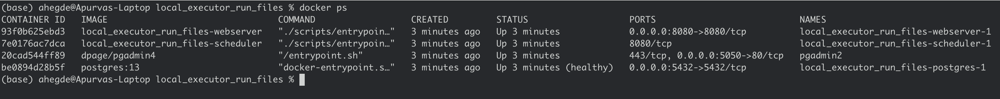

Output of docker ps command

3. Open the airflow web UI by typing the port address in a web browser (it might take a few minutes before this port works, keep refreshing the page.) Log in with the credentials specified during the docker/airflow set up process in the [entrypoint.sh](http://entrypoint.sh) file. For us, the web address is localhost:8080 and the credentials are user=admin, password=admin. When you log in, your dag should show up on the home page. Click on the dag name and hit the little right-arrow icon on the right side to trigger dag. Your dag is now running.

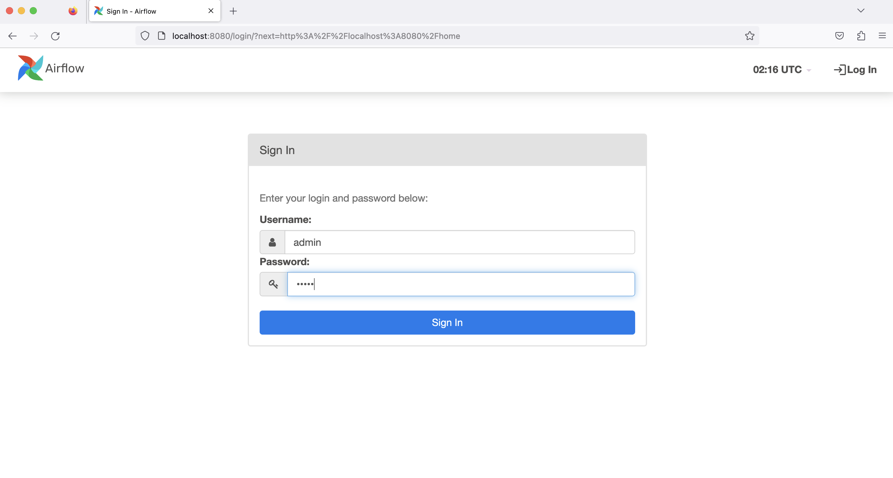

Airflow login 

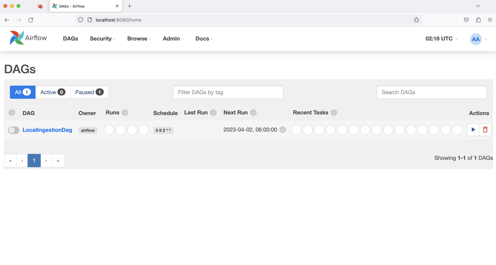

Airflow home page after login

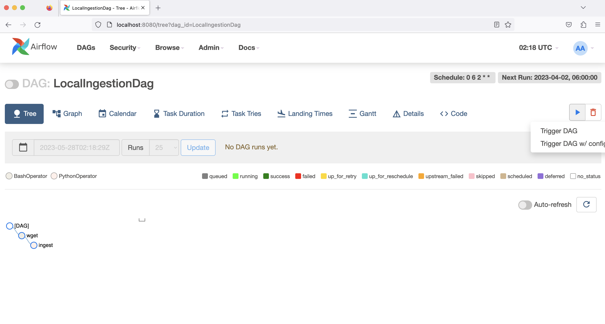

Trigger the dag by clicking the right-arrow button on the right side of the page

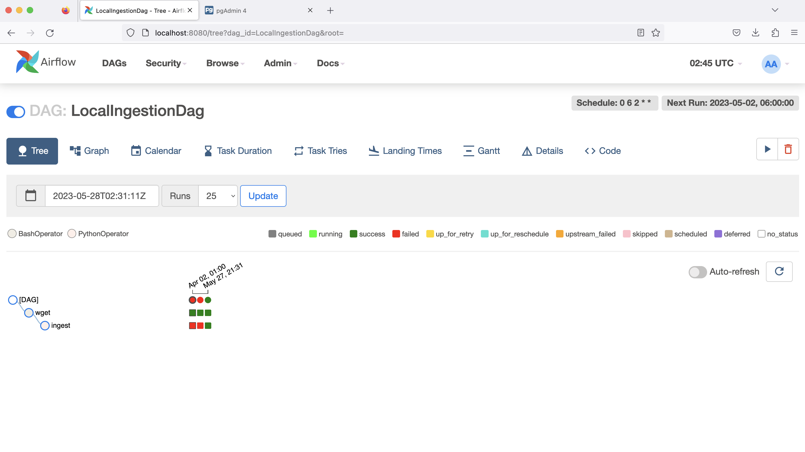

Two green squares indicates a successful run. This will take a few minutes to complete, until then you will see the squares in the “running” state (fluorescent green color).

4. If the dag fails and you want to debug, you can inspect the logs of the individual tasks of your workflow. To do this, in the terminal, use the docker ps command to get container ID for the scheduler and open it using the docker exec command:

```bash
docker ps

docker exec -it <container ID number> bash
```

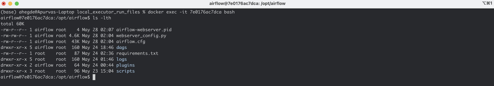

Output of docker exec

Once inside, you can inspect the logs of that container for details on the run.

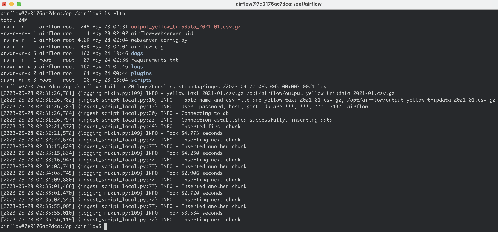

Inspection of logs while dag is running

5. While the dag is running (it takes a few mins to complete), you can inspect the postgres database in pgAdmin. Log into pgAdmin in a browser using the port number and credentials you specified during docker/pgAdmin (for us, this is localhost:5050, user=admin@admin.com, password=root). You will need to register a new server, login creds are those of the postgres db we specified in the docker-compose yaml (user: postgres, password postgres)

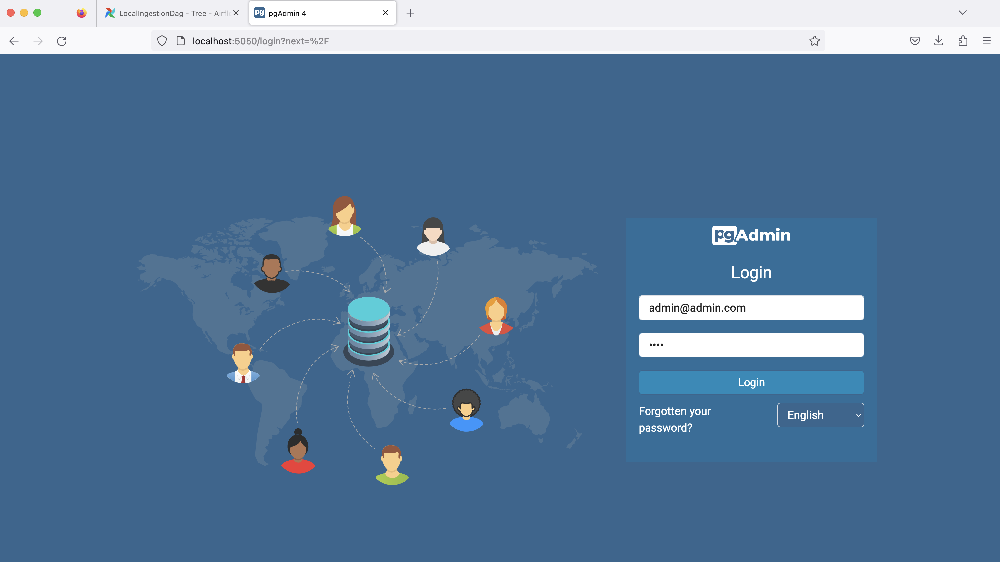

pgAdmin login page

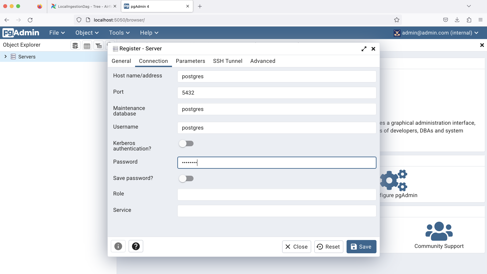

Register a new server

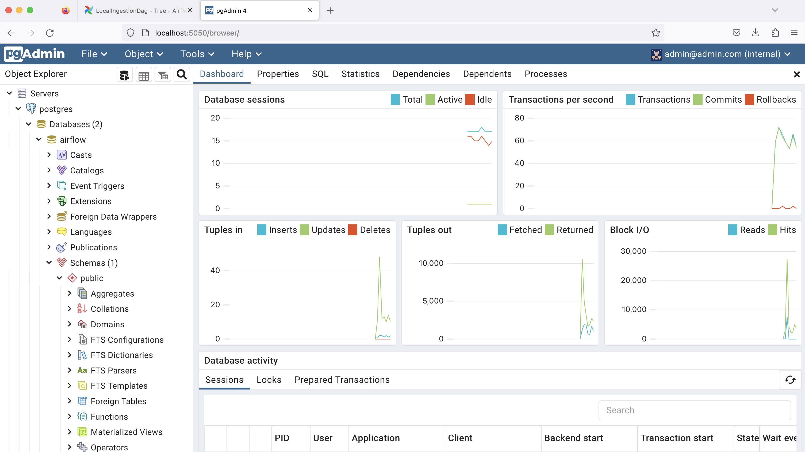

Landing page after connecting with the postgres db

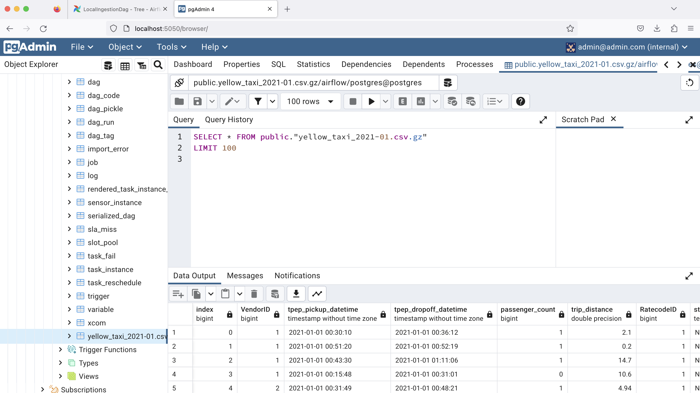

The yellow_taxi table should be created and accessible even if the dag is still running

## Files required to run Airflow with LocalExecutor via Docker:
This section provides a brief explanation of the files required to run Airflow using LocalExecutor via Docker.

### ingest_script_local.py
This original script: [https://rb.gy/bj2c9](https://rb.gy/bj2c9)  was modified to include some additional print statements to help with debugging.

This file is saved in the /scripts folder within the airflow directory. For this project, we are interested in downloading a csv file containing New York Taxi data hosted here: [https://github.com/DataTalksClub/nyc-tlc-data/releases/](https://github.com/DataTalksClub/nyc-tlc-data/releases/) (originally available on the New York Taxi website [https://www.nyc.gov/site/tlc/about/tlc-trip-record-data.page](https://www.nyc.gov/site/tlc/about/tlc-trip-record-data.page)).  

This script imports the dataset as an iterator. It establishes a connection to the postgres database and ingests the csv data into the database in chunks.

### data_ingestion_local.py
This is the dag file used by Airflow for workflow orchestration. There are two tasks specified in the script - wget_task and ingest_task. The wget_task downloads the csv file into the home directory within the container that is running the scheduler. This downloaded file is then passed as an input into the ingest_task. The above ingest_script_local.py script is imported into the data_ingest_local.py dag to be used as a callable python function within the ingest_task. 

Some variables are declared in the beginning of the dag script. These are either environment variables being used within the container and/or environment variables specified in the .env file (explained below). Note: I used the default value of "PG_HOST" from this document [https://github.com/DataTalksClub/data-engineering-zoomcamp/blob/4ecddc7ed8264b694136de2a6e84ce6f88401695/cohorts/2022/week_2_data_ingestion/airflow/.env_example#L18](https://github.com/DataTalksClub/data-engineering-zoomcamp/blob/4ecddc7ed8264b694136de2a6e84ce6f88401695/cohorts/2022/week_2_data_ingestion/airflow/.env_example#L18) . I'm not entirely sure why this works.

### requirements.txt
This file contains the names and versions of all packages used in the above python programs that need to be installed inside the container.

### .env file
This file contains the environment variables used by the above python script (data_ingestion_local.py) as well as the variables used by the docker-compose.yaml file when it is run. First export the airflow user ID and group ID variables from inside the airflow directory into an empty .env file:

```bash
echo -e "AIRFLOW_UID=$(id -u)\nAIRFLOW_GID=0" > .env
```

Next, add the lines after “AIRFLOW_GID=0” into the .env file. This will include all the other variables required by the workflow. Save this .env file in the airflow directory (same location as the docker-compose.yaml file).

### docker-compose.yaml
I modified the original no-frills version of docker-compose.yaml available here: [https://rb.gy/v9cib](https://rb.gy/v9cib) to include the port for postgres, as well as an additional pgAdmin service block. The .env file is included in services that import environment variables mentioned in the .env file. I chose to assign port 8080 to the airflow webserver, so I used an alternative port for pgAdmin (5050). Postgres is assigned its default port (5432).

### dockerfile
This is a simplified dockerfile that only includes the components required to run airflow locally. Make sure your airflow version in the dockerfile matches the one listed in requirements.txt. Also make sure you update the path to [entrypoint.sh](http://entrypoint.sh) file (discussed in detail below) to the location you have saved it in, if different from the ./scripts folder.

### entrypoint.sh
This file contains the list of executables that will always run after the container is initiated. Note: the exec line that executes webserver and scheduler has to be specifically written such that both the exec commands are in one single line. Splitting the two exec commands does not run the scheduler. Also pay close attention to the airflow username and login details. These are the credentials used to log into airflow web UI.

Note: Some things that I had to troubleshoot to get the LocalExecutor run working: airflow login IDs, postgres login IDs, volumes, exec airflow webserver & exec airflow scheduler line in [entrypoint.sh](http://entrypoint.sh) — this command can not be on two lines, else it does not trigger the scheduler, update location of entrypoint.sh in dockerfile, add all python packages to be installed in requirements.txt.